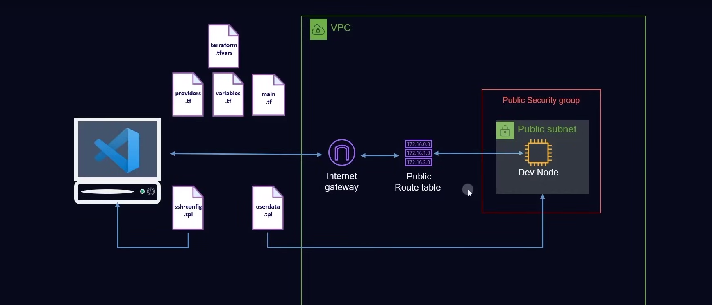

## Introduction

In this project, I build a complete and reusable development environment on AWS using Terraform. The proposal is to automate all the infrastructure necessary for a development server accessible remotely via SSH in VS Code, following good automation and cloud provisioning practices.



## Project Structure

The project files are organized as follows:

```
terraform-dev-project/
├── main.tf                  # Main Terraform configuration
├── variables.tf             # Variable declarations
├── terraform.tfvars         # Variable values
├── providers.tf             # AWS provider configuration
├── datasources.tf           # Data sources (AMIs)
├── userdata.tpl             # Bootstrap script for the EC2 instance
├── linux-ssh-config.tpl     # Local SSH config template
├── terraform.tfstate        # Terraform state file
├── terraform.tfstate.backup # Backup state
```

The templates `userdata.tpl` and `linux-ssh-config.tpl` are used to automatically configure the EC2 instance and the developer's SSH client, allowing immediate access to the development node.

## AWS Provider

```hcl
provider "aws" {
  region = "us-west-2"
}
```

This block initializes the AWS provider and defines the region where all resources will be provisioned. The `us-west-2` region was chosen, but it can be easily adapted via variables.

## VPC and Networking

```hcl
resource "aws_vpc" "mtc_vpc" {
  cidr_block           = "10.123.0.0/16"
  enable_dns_support   = true
  enable_dns_hostnames = true
}
```

- **CIDR Block**: Creates a private IP space for your infrastructure.
- **DNS Hostnames**: Enabled to allow name resolution within the VPC, useful for internal communication.

A public subnet is also created to host the development EC2 instance:

```hcl
resource "aws_subnet" "mtc_public_subnet" {
  cidr_block              = "10.123.1.0/24"
  map_public_ip_on_launch = true
  vpc_id                  = aws_vpc.mtc_vpc.id
  availability_zone       = "us-west-2a"
}
```

An Internet Gateway and Route Table are provisioned to provide internet access:

```hcl
resource "aws_internet_gateway" "mtc_internet_gateway" {
  vpc_id = aws_vpc.mtc_vpc.id
}

resource "aws_route_table" "mtc_public_rt" {
  vpc_id = aws_vpc.mtc_vpc.id
}

resource "aws_route" "default_route" {
  route_table_id         = aws_route_table.mtc_public_rt.id
  destination_cidr_block = "0.0.0.0/0"
  gateway_id             = aws_internet_gateway.mtc_internet_gateway.id
}
```

These are then associated with the subnet to allow the EC2 instance to access the internet.

## Security Group

```hcl
resource "aws_security_group" "mtc_sg" {
  vpc_id = aws_vpc.mtc_vpc.id

  ingress {
    from_port   = 0
    to_port     = 0
    protocol    = "-1"
    cidr_blocks = ["0.0.0.0/0"]
  }

  egress {
    from_port   = 0
    to_port     = 0
    protocol    = "-1"
    cidr_blocks = ["0.0.0.0/0"]
  }
}
```

This open security group allows all inbound and outbound traffic, which is acceptable for learning purposes, but not recommended for production.

## EC2 Instance for Development

```hcl
resource "aws_instance" "dev_node" {
  instance_type = "t2.micro"
  ami           = data.aws_ami.server_ami.id
  subnet_id     = aws_subnet.mtc_public_subnet.id
  key_name      = aws_key_pair.mtc_key_pair.key_name

  vpc_security_group_ids = [aws_security_group.mtc_sg.id]
  user_data              = file("userdata.tpl")

  root_block_device {
    volume_size = 10
  }

  provisioner "local-exec" {
    command = templatefile("linux-ssh-config.tpl", {
      hostname     = self.public_ip,
      user         = "ubuntu",
      identifyfile = "~/.ssh/metckey"
    })
    interpreter = var.host_os == "windows" ? ["powershell", "-Command"] : ["bash", "-c"]
  }
}
```

- Uses a custom AMI filter to fetch the latest Amazon Linux 2023 image.
- Installs Docker and other dev tools using `userdata.tpl`.
- Automatically configures SSH access for use in VS Code Remote SSH.

## SSH Key Pair

```hcl
resource "aws_key_pair" "mtc_key_pair" {
  key_name   = "mtckey"
  public_key = file("~/.ssh/metckey.pub")
}
```

This resource makes your local SSH public key available in AWS so you can connect securely.

## User Data Script (userdata.tpl)

```bash
#!/bin/bash
sudo apt-get update -y &&
sudo apt-get install -y \
  apt-transport-https \
  ca-certificates \
  curl \
  gnupg-agent \
  software-properties-common &&

curl -fsSL https://download.docker.com/linux/ubuntu/gpg | sudo apt-key add - &&
sudo add-apt-repository \
  "deb [arch=amd64] https://download.docker.com/linux/ubuntu $(lsb_release -cs) stable" &&
sudo apt-get update -y &&
sudo apt-get install -y docker-ce docker-ce-cli containerd.io &&
sudo usermod -aG docker ubuntu
```

Installs Docker and prepares the development environment automatically when the EC2 instance starts.

## How to Execute

1. **Initialize Terraform**

   ```bash
   terraform init
   ```

2. **Apply the Infrastructure**

   ```bash
   terraform apply
   ```

Once completed, your development environment on AWS is live and ready for SSH access directly from VS Code.

## Final Thoughts

Although this is a simple project, it was good to validate the knowledge I gained and be able to feel more comfortable using the Terraform tool.